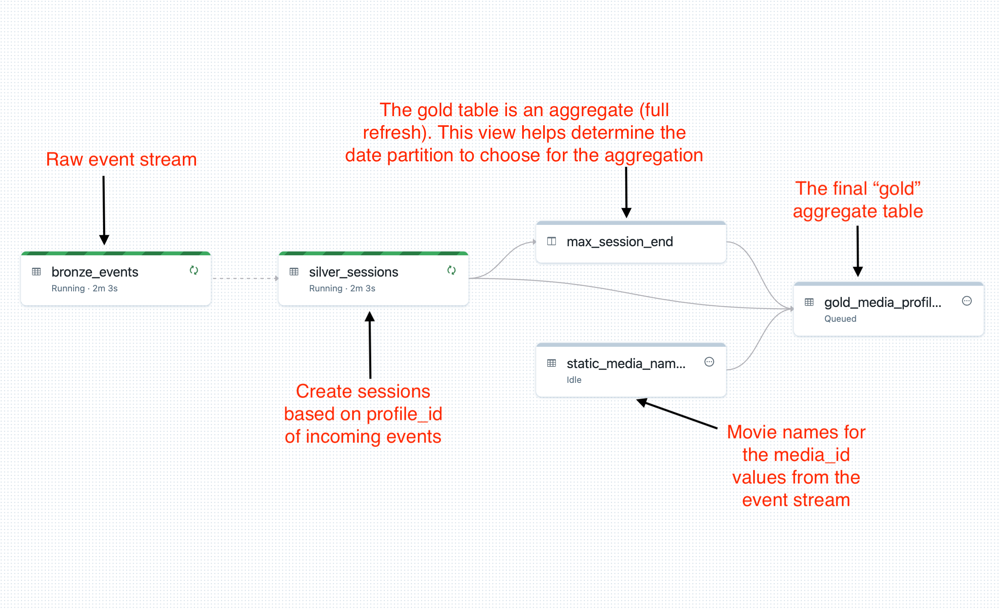

# Overview
This set of notebooks demonstrates an event stream and how those events can be "sessionized" using the `session_window` feature.

# Steps
1. Run the Simulator to build an event stream. If the events stop getting created, that is fine. The DLT pipelines can be reset (use "Full Refresh") and the DLT Pipelines will treat the data the same as it would streaming real-time data.
2. Run the "Install_DLT_Pipeline" notebook to install two DLT Pipelines. One will sessionize the event stream and will run in Continuous mode. The other will need to be run manually (or scheduled to run daily)
3. Read the DLT-Sessionize-Stream-and-Batch-Aggregate notebook comments. Play around with the different modes and adjust the properties as needed.